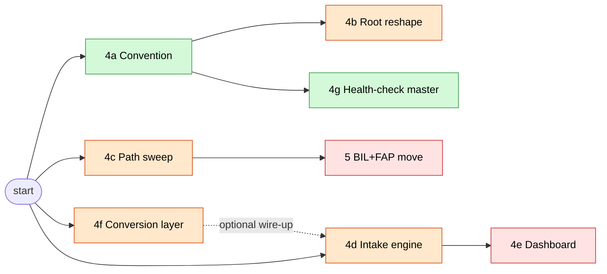

# X-drive reorg — Codex prompt bank

**Created:** 2026-05-16 by claude-code-forge
**For:** Codex (X drive infrastructure owner per [partner role lock](../../../../David/maps-and-notes/SESSION_LOG_2026-05-16_OPUS_ARCHITECTURAL.md))
**Approved plan:** `C:\Users\lowes\.claude\plans\yes-i-want-togo-agile-puddle.md`
**Architecture map:** `X:\ARCHITECTURE.md`
**Folder conventions:** `X:\FOLDER_CONVENTIONS.md`

---

## What's in here

| # | Prompt | Scope | Risk | Depends on |
|---|---|---|---|---|
| 4a | [Folder convention rollout](4a_folder_convention_rollout.md) | 15 missing READMEs (L1) + rename intake to `00_DROP/` (L2) + `_AGENT_BRIEF.md` + `RUN_AGENT.bat` + `health_check.bat` per NLP (L2 new) | Low | — |
| 4b | [Root simplification](4b_root_simplification.md) | Move 9 NLPs under `X:\00_WORKFLOWS\`, junctions at old paths | Medium | 4a complete |
| 4c | [Batch-script path sweep](4c_batch_script_sweep.md) | Rewrite 78 `D:\BIL\*` + `D:\FAP` refs across 10 BIL files + Task Scheduler XML | Medium | — |
| 4d | [Intake engine — separable Python program](4d_intake_engine_program.md) | Watchdog + Ollama Mistral classifier + router as portable Python package | Medium | — |
| 4e | [PySide 6 workflow composer](4e_pyside_workflow_composer.md) | GUI = operating surface: Monitor + Compose + Run + Health panes. Reads workflow-config / state-manifest / dependencies JSON contracts. Replaces .bat clicks. | Medium | Backside architecture (BACKSIDE_ARCHITECTURE.md) + 4a complete |
| 4f | [Conversion layer](4f_conversion_layer.md) | MarkItDown + Whisper + YouTube + OCR + TTS unified as library + standalone NLP. Any format → canonical markdown | Medium | — |
| 4g | [Root health-check master](4g_root_checks_master.md) | `X:\CHECKS\RUN_ALL.bat` — orchestrates per-NLP `health_check.bat` + shared services + framework anchors → single report | Low | 4a complete |
| 5 | [BIL + FAP migration](5_bil_fap_migration.md) | `robocopy /MOVE D:\BIL X:\BIL` + Task Scheduler re-import, verify FAP sync | High | 4c complete |
| 6 | [2026-05-20 root reorg execution](6_root_reorg_execute_2026-05-20.md) | Apply the new root contract: `David`, `GUI`, `Conversions`, `EXPORTS`, `Backside`; move models/workflows/control-plane/state behind the proper front doors | High | 4a path inventory + compatibility plan |

**Template referenced by 4a:** [`_AGENT_BRIEF_TEMPLATE.md`](_AGENT_BRIEF_TEMPLATE.md) — per-NLP agent-brief source.
**Framework anchor referenced everywhere:** [`X:\THEOPHYSICS_PRIMER.md`](../../../THEOPHYSICS_PRIMER.md) — load this in every AI session.

---

## Implementation snapshot — 2026-05-16

- **4a is partial:** generated artifact pack exists under `4a-output/`; `apply_4a.ps1` is dry-run-first and safer than the original direct-junction command, but live X:\ acceptance checks still need to run.
- **4e is partial:** `Backside/brain_dashboard` is a dashboard MVP with passing tests. The broader Workflow Composer scope is not complete.
- **4f is partial:** `Backside/conversion_lib` and `00_WORKFLOWS/conversion-layer` exist and smoke-test for Markdown/text conversion. Full MarkItDown, Whisper, OCR, and YouTube coverage still needs deeper adapter tests.
- **Station lab is sidecar:** `Backside/station_lab` exists for paper-grader station tuning. It is useful, but it is not the 4d intake engine.
- **4b, 4c, 4d, 4g, and 5 remain prompt-out work** until their acceptance checks run against the live X:\ and D:\ paths.

---

## Dependency graph

**Parallel-safe groups (Codex can run these concurrently):**
- Group 1: **4a** (folder conventions — files only)
- Group 2: **4c** (script sweep — D:\BIL files only)
- Group 3: **4d** (new program — fresh code, no existing-state touch)
- Group 4: **4f** (new program — fresh code, no existing-state touch)

**Sequential:**
- **4b** after 4a (so the convention is locked before the big NTFS-junction reshape)
- **4e** after 4d (dashboard consumes engine state schema)
- **5** after 4c (refs must be updated before files move)
- **4d+4f wire-up** (optional, after both ship — engine calls conversion before classifying binaries)

---

## How to use this bank

1. **Post to Codex:** comms hub `prompts/x-drive-reorg` channel — paste prompt body, link the file.
2. **Codex returns work:** he ships a branch / writes files / posts a status update.
3. **claude-code-forge (this seat) reviews:** runs the prompt's "Acceptance check" section, flags issues, drafts revision prompt if needed.
4. **Iterate** until acceptance check passes.

---

## Absolute rules every prompt must honor

- **No file deletions.** Every "delete" is a move to `_ARCHIVE/` (per [CLAUDE.md](../../../../../../AppData/Local/Programs/Warp/CLAUDE.md) and reference impl `phase3_moves.ps1`).
- **Junctions preserve old paths** during transition cycles. Don't break tribal-memory paths abruptly.
- **No emoji in code or filenames.** Text labels only.
- **Use Filesystem MCP for NAS paths.** Desktop Commander unreliable on `\\dlowenas\*`.
- **JSON-via-curl quirk:** inline `-d "{...}"` breaks. Use `python json.dump` to a temp file, then `--data-binary @file`.

---

## Review checklist (for claude-code-forge when Codex returns)

For each delivered prompt:
- [ ] Acceptance check command runs clean
- [ ] No files were deleted (only moved/archived)
- [ ] Junctions at old paths resolve correctly
- [ ] No new hardcoded `\\dlowenas\brain\` references introduced
- [ ] Logs at `X:\_LOGS\<prompt_id>_log_YYYY-MM-DD.md`
- [ ] README at the deliverable folder lists what changed and how to roll back

If any item fails, draft a focused revision prompt and post back to Codex.
