# X:\ Brain — Architecture Map

**Owner:** David Lowe (POF 2828)
**Last updated:** 2026-05-16 by claude-code-forge
**Plan:** `C:\Users\lowes\.claude\plans\yes-i-want-togo-agile-puddle.md`

This is the live map of the X:\ brain. It mixes **current state (2026-05-16)** with **target state (post-Phase-4)** — each diagram labels which it shows.

X:\ is the NAS share `\\dlowenas\brain\` mounted as a drive. When this doc says "the brain," that's X:\ root.

## 0. 2026-05-20 root target

David's revised cleanup rule is that the root is a front door, not the runtime shelf.

```text
X:\
  David\        human-facing notes and session entrypoints
  GUI\          dashboards and control panels
  Conversions\  active conversion front door
  EXPORTS\      final reproducible HTML / Excel / metadata packages
  Backside\     workflows, models, services, stations, control plane, state, archives
```

Root workflow folders such as `knowledge-refinery`, `paper-proof-grader`, `session-handoff-drop`, `models`, `ollama`, and `Preference Engine Build` are transitional until migrated according to `ROOT_REORG_TARGET_2026-05-20.md`.

---

## 1. System overview — what lives on X:\

**Current shape (after Phase 1 consolidation).** Five zones.

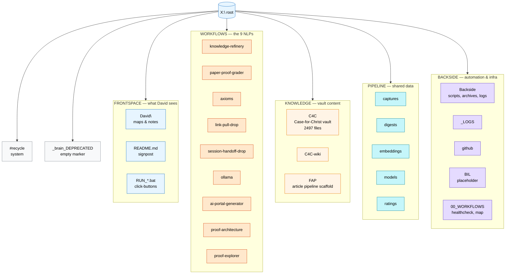

---

## 2. Drop-to-output lifecycle — what happens to a file

**Target state (Phase 4 intake engine in place).** This is the end-to-end journey of a single dropped file.

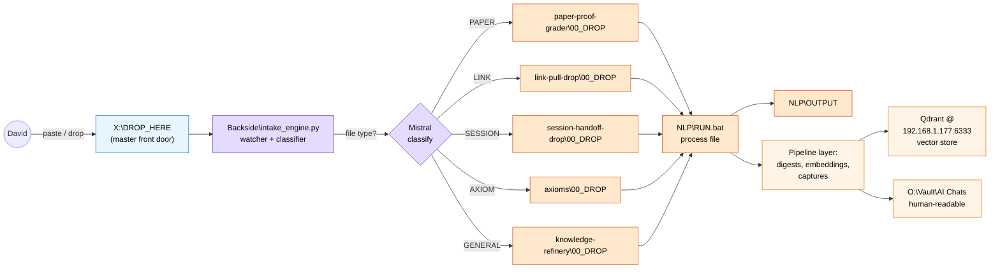

---

## 3. Backside intake engine — the layer "in between"

This is the bit that lives **between** "David drops a file" and "the NLP runs." Today: doesn't exist (everything is manual `.bat` clicks). Target state shown.

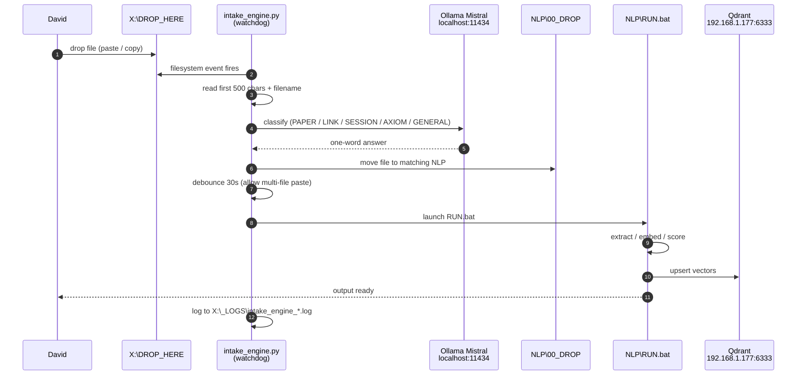

**Key properties:**
- One watcher per NLP `00_DROP/` plus one for the master `X:\DROP_HERE\`
- Master-drop classification uses local Ollama Mistral (no cloud)
- Per-NLP drops skip classification and trigger that NLP's RUN directly
- 30-second debounce so a multi-file paste fires one run, not five
- Restart-safe: on boot, sweeps all drop folders for backlog

---

## 4. Per-NLP standard shape — the front door

**Target state (Appendix A of plan).** Every NLP folder follows this shape so new AIs / humans never have to guess.

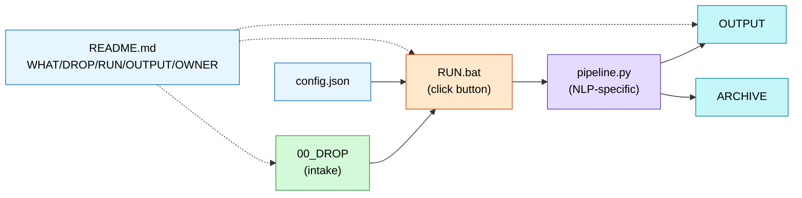

Every NLP gets the same 5-line README contract:

```
WHAT: <one sentence>
DROP HERE: ./00_DROP/
RUN: ./RUN.bat
OUTPUT: <path>
OWNER: <AI partner>
```

---

## 5. The 9 NLPs — what each one is for

**Current state.** Two have full automation, four have basic pipelines, three are publishing endpoints.

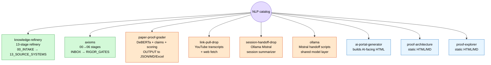

**Legend:**
- **Green (full):** structured multi-stage pipeline, can run end-to-end today.
- **Orange (basic):** working pipeline.py, single RUN.bat, no stage architecture.
- **Blue (publishing):** static output zone, no intake — content lands here from upstream.

---

## 6. knowledge-refinery — the most structured NLP

The 13-stage refinery is the template the others *could* converge to. Each stage is a numbered folder.

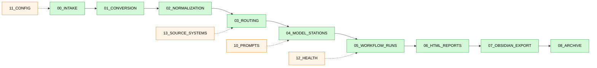

Solid arrows = data flow. Dashed = configuration the stages read.

---

## 7. paper-proof-grader — DeBERTa scoring pipeline

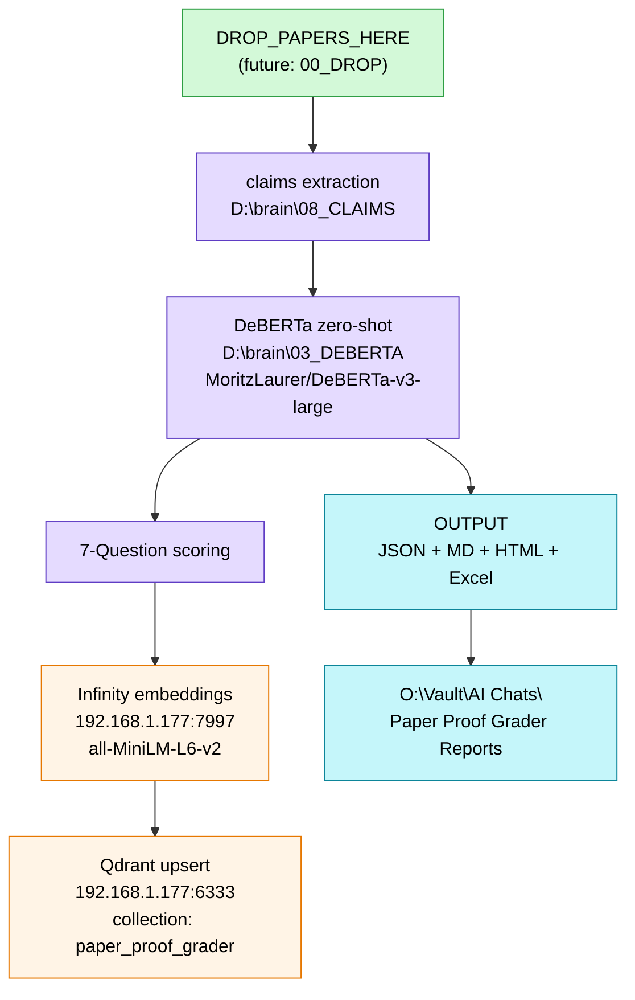

Note: DeBERTa model + claims extractor still live on D:\brain\ (different system from X:\). Won't migrate as part of this restructure.

---

## 8. Shared data layer — where outputs converge

All NLPs feed into the same downstream stores. This is the "memory" of the brain.

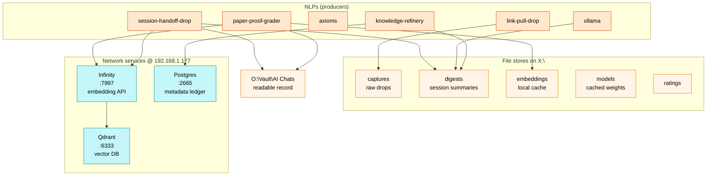

---

## 9. Consolidation status — what moved and what's still pending

**Phase status as of 2026-05-16.** Tracks the actual restructure progress.

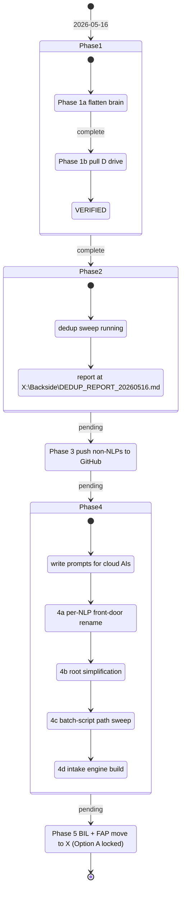

---

## 10. The D-drive consolidation — what's coming to X:

David's directive 2026-05-16: *everything that deals with X: lives on X:*. BIL decision: **Option A — full move** (supersedes May-10 cold-archive lock).

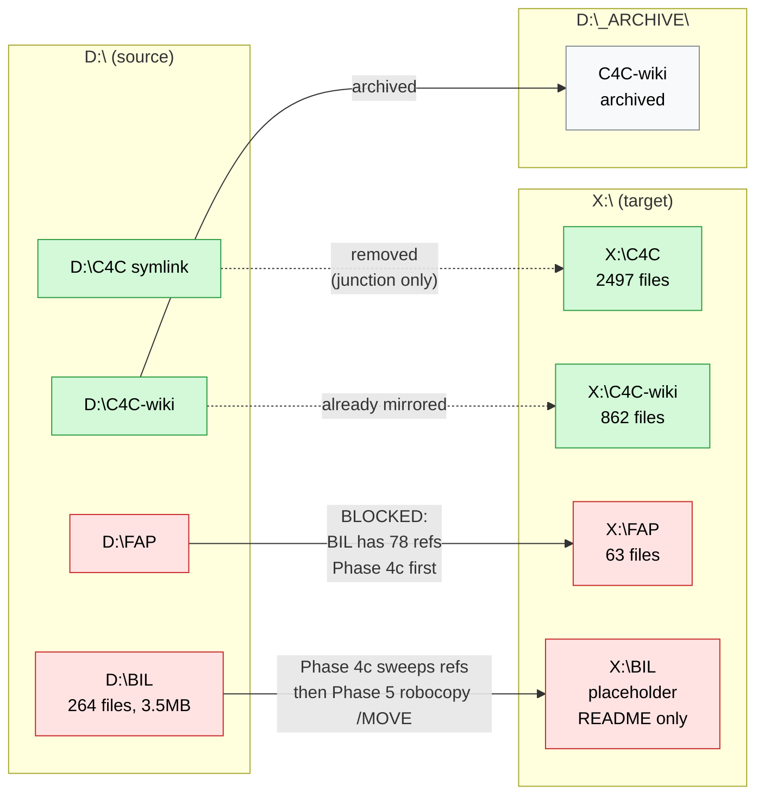

**Why D:\FAP is blocked:** D:\BIL\engines\pipeline\* hardcodes `D:\FAP` in 78 places across 10 files (fap_postgres_sync.py, fap_healthcheck.py, llm_hub.py, fap_dashboard.html, etc.). The FAP postgres sync runs every 12h. If we move D:\FAP before sweeping the refs, the next sync fails. So:

1. **Phase 4c (cloud AI):** find/replace `D:\BIL\` → `X:\BIL\` and `D:\FAP` → `X:\FAP` across all D:\BIL scripts. Update Task Scheduler XML.
2. **Phase 5:** stop the FAP scheduled task, `robocopy /MOVE D:\BIL X:\BIL`, `robocopy /MOVE D:\FAP X:\FAP`, re-import the task pointing at X:, re-enable, verify one cycle runs clean.

---

## 11. Mental model — the simplest possible version

If you forget everything else, remember this:

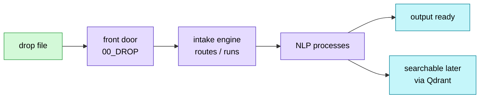

That's the whole brain. Everything else is detail.

---

## Where to dig deeper

- **Plan with phased execution:** `C:\Users\lowes\.claude\plans\yes-i-want-togo-agile-puddle.md`
- **Phase 1 logs:** `X:\Backside\PHASE1A_LOG_20260516.md`, `PHASE1B_LOG_20260516.md`, `PHASE1_PATH_FIX_LOG_20260516.md`
- **Dedup report (Phase 2, running):** `X:\Backside\DEDUP_REPORT_20260516.md`
- **CLAUDE.md (operating manual):** `C:\Users\lowes\AppData\Local\Programs\Warp\CLAUDE.md`
- **Canon (locked theory):** comms-hub `canon` channel — canon wins on drift
