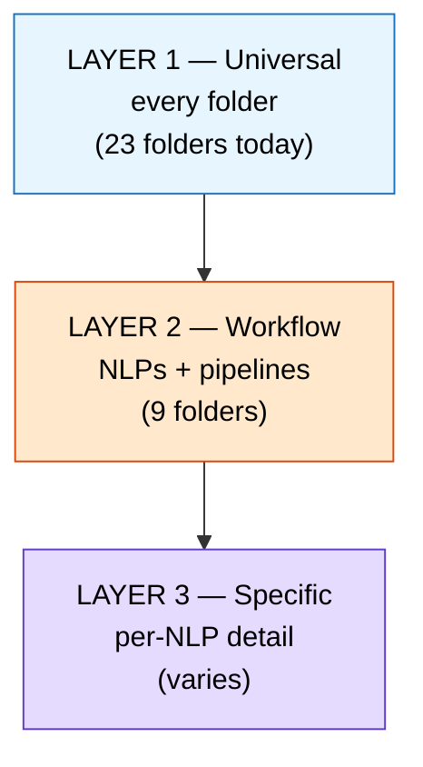

# X:\ Folder Conventions

**What this is:** The contract every folder on X:\ should honor — three layers, most-shared to least.
**Owner:** shared (claude-code drafted 2026-05-16, owned by David Lowe)
**Status:** live · proposal pending review

The goal: open any folder and within 10 seconds know **what it is, who owns it, and how to use it.** No tribal knowledge, no AI partner having to grep code to figure it out.

---

## Why three layers

Most folders share *some* structure. Some folders share *more*. Three concentric circles:



A folder must honor every outer layer that applies. A workflow folder honors L1 + L2 (+ optionally L3). A content/data folder honors only L1.

---

## LAYER 1 — Universal (every folder)

**The minimum contract for every folder on X:\.** This is the README David explicitly asked for: *"what is this folder, what does it do."*

### Required file: `README.md` at the folder root

### Required fields (top-of-file, frontmatter or plain block):

```markdown
# {folder-name}

**What this is:** <one sentence>
**Owner:** <AI partner | "shared" | David>
**Status:** live | archive | experimental | placeholder
**Last updated:** YYYY-MM-DD

<optional: 1–2 paragraphs of context — why this exists, what problem it solves>

## What's inside

- `<child folder or file group>` — <one line of purpose>
- ...
```

### That's it for L1. Five lines + a one-line table of contents.

### Why these five:

- **What this is** — answers David's question. The reader knows in 5 seconds.
- **Owner** — names who keeps it healthy. Anonymous folders rot.
- **Status** — separates live work from archive/dead-end. Future-you avoids touching archived folders.
- **Last updated** — staleness check. If "Last updated: 2025-09" and we're in 2026-05, treat with suspicion.
- **What's inside** — saves the next person from blind-globbing.

---

## LAYER 2 — Workflow (NLPs + active pipelines)

A workflow folder is one that takes input → processes → produces output. The 9 NLPs on X:\ are workflow folders. So is anything else that drops/runs (link-pull-drop, session-handoff-drop, paper-proof-grader, etc.).

**Honors Layer 1 PLUS:**

### Required structure:

```
<workflow-folder>/
  README.md              ← Layer 1 fields + Layer 2 block below (HUMAN-facing)
  _AGENT_BRIEF.md        ← AI-facing mission card (loaded by RUN_AGENT.bat)
  RUN.bat                ← single click-button entry point
  RUN_AGENT.bat          ← launches an LLM with _AGENT_BRIEF.md + PRIMER as context
  health_check.bat       ← probe: models reachable, paths writable, deps present
  config.json            ← parameters (paths, model names, flags)
  prompts/               ← prompt templates the Python code loads at runtime
  00_DROP/               ← intake (the "front door")
  OUTPUT/                ← results land here
  ARCHIVE/               ← processed inputs move here
  pipeline.py            ← (or other implementation file)
```

**Why the README/AGENT_BRIEF split:** README answers "what is this folder" for a human in 10 seconds. AGENT_BRIEF answers "what is your mission inside this workflow" for an AI walking in cold. Different readers, different shapes — but both contracts.

**Why prompts/ as a folder:** Python = mechanics (deterministic), prompts = judgment (LLM calls). Keeping prompt templates as `.md` files in `prompts/` makes them version-controllable, AI-editable, and reusable across workflows.

**Why health_check.bat per workflow:** the root `X:\CHECKS\RUN_ALL.bat` cycles through every workflow's local probe and aggregates one report. Each workflow knows how to validate itself; the master just orchestrates.

### Required README block (added below Layer 1 fields):

```markdown
## Pipeline contract

- **DROP HERE:** `./00_DROP/` — <what file types are accepted>
- **RUN:** `./RUN.bat` — <what a click does>
- **OUTPUT:** `./OUTPUT/` — <what gets produced>
- **ARCHIVE:** `./ARCHIVE/` — <when inputs move here>
- **CONFIG:** `./config.json` — key fields: <list 2–3 params>

## What happens

1. <step one in plain English>
2. <step two>
3. <step three>
```

### The standardized names matter

Every workflow folder uses the same names so an AI / new contributor can navigate by reflex:

| Old name (today) | New name (Layer 2 standard) |
|---|---|
| `00_INTAKE`, `INPUT`, `DROP_PAPERS_HERE`, `DROP_HERE`, `00_INBOX_DROP_PAPERS_HERE` | `00_DROP` |
| `OUTPUT`, `output` | `OUTPUT` |
| `ARCHIVE`, `archive`, `_archive` | `ARCHIVE` |
| Various RUN scripts | `RUN.bat` |
| Various configs | `config.json` |

Junctions can stay at old names for one transition cycle so old scripts don't break — Phase 4 of the plan handles that batch sweep.

---

## LAYER 3 — Specific (per-NLP detail)

The bottom layer is where NLPs differ honestly. There's no point pretending paper-proof-grader and link-pull-drop work the same — they don't. Layer 3 documents what makes each one unique.

**Honors Layer 1 + Layer 2 PLUS:**

### Required README block:

```markdown
## Specific to this workflow

- **Models / external services:** <e.g. DeBERTa via D:\brain\03_DEBERTA, Infinity @ 192.168.1.177:7997>
- **Dependencies:** <Python packages, Ollama models, network services>
- **Known gotchas:** <things that broke before, edge cases>
- **Where outputs flow downstream:** <Qdrant collection, Obsidian path, etc.>
```

### Examples of what goes here

- **paper-proof-grader:** DeBERTa-v3-large zero-shot, Fruits-of-Spirit bridge, 7-Question scoring, Qdrant collection `paper_proof_grader`.
- **link-pull-drop:** youtube-transcript-api + yt-dlp + BeautifulSoup, output manifest JSON.
- **session-handoff-drop:** Ollama Mistral local, Infinity embeddings, multi-mirror destinations.
- **knowledge-refinery:** 13 numbered stages, conductor pattern, HTML+Obsidian export.
- **axioms:** rigor gates 00→06, axiom manifest schema.

---

## Current state — gap analysis (2026-05-16)

23 real folders on X:\ root (excluding system: #recycle, _LOGS, _brain_DEPRECATED).

**Have README.md today (8):**
- ✓ 00_WORKFLOWS
- ✓ ai-portal-generator
- ✓ axioms
- ✓ Backside
- ✓ BIL (placeholder)
- ✓ David
- ✓ knowledge-refinery
- ✓ paper-proof-grader

**Missing README.md (15):**

| Folder | Layer it needs | Notes |
|---|---|---|
| C4C | L1 | Big Obsidian vault — README should point to the `00-START-HERE` inside |
| C4C-wiki | L1 | Companion wiki; README should explain raw/wiki schema |
| captures | L1 | Raw drops zone, captures from external tools |
| digests | L1 | Pipeline output: session summaries |
| embeddings | L1 | Vector store local cache (Qdrant-style) |
| FAP | L1 | Article pipeline scaffold (empty stages today) |
| github | L1 | GitHub repo clones — index of which repos and why |
| link-pull-drop | L1 + L2 | Active NLP; needs full workflow contract |
| models | L1 | Cached model weights; README should list which models and where they're used |
| ollama | L1 + L2 | Mistral session-handoff scripts; L2-light (utility, not full pipeline) |
| proof-architecture | L1 | Static HTML output zone — no L2 needed (publish-only) |
| proof-explorer | L1 | Static HTML output zone — no L2 needed |
| ratings | L1 | Purpose unclear without README — exact reason this matters |
| session-handoff-drop | L1 + L2 | Active NLP; needs full workflow contract |
| theophysics-comms-hub | L1 | Single README for the comms hub API docs |

---

## What "color folders" could mean (deferred — David flagged 2026-05-16)

Windows Explorer can color folder icons via `desktop.ini` + custom `.ico` files. But that doesn't render in NAS browsers, on Mac, in Obsidian's file tree, or in any AI partner's `ls`. So a fragile signal.

Alternatives that DO survive cross-tool:

1. **Numeric prefix grouping** (extension of existing `00_WORKFLOWS` pattern):
   - `00_*` = framework / system
   - `01_NLP_*` = workflow folders
   - `02_KNOWLEDGE_*` = vault content (C4C, FAP)
   - `03_PIPELINE_*` = shared data (captures, digests, embeddings)
   - `04_BACKSIDE_*` = automation infra
   - `_*` = archives / system markers
   **Pros:** sortable in any tool. **Cons:** renames everything — breaks tribal-memory paths.

2. **Unicode prefix** (e.g., `▶ paper-proof-grader`, `▣ C4C`, `◆ Backside`):
   - **Pros:** visual without numeric noise. **Cons:** some shells / tools don't render glyphs cleanly.

3. **README badge** (the cheapest signal — already in the Layer 1 contract):
   - Use `**Status:**` line to declare. Every tool that opens README sees it. No filesystem rename needed.

**Recommendation: option 3 today.** Revisit option 1 if the README badges aren't visually enough after a month.

---

## How to apply this — proposed sequence

1. **Phase 2.5 (now-ish):** generate Layer 1 READMEs for the 15 missing folders. Cheap — `claude-code` can infer purpose from folder contents, write the 5-field stub, David edits.
2. **Phase 4a (cloud-AI delegated):** rename intake folders to `00_DROP/`, write Layer 2 + Layer 3 blocks for all workflow folders. Junctions preserve old paths.
3. **Phase 4d (intake engine build):** the engine reads every NLP's `config.json` to know what file types to route — the L2 contract makes that contract-driven instead of hardcoded.

---

## Related

- Full plan: `C:\Users\lowes\.claude\plans\yes-i-want-togo-agile-puddle.md`
- Architecture map: `X:\ARCHITECTURE.md` (the Mermaid maps)
- Dedup audit: `X:\Backside\DEDUP_REPORT_20260516.md`
