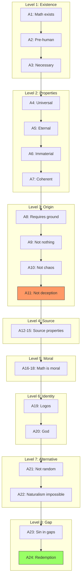
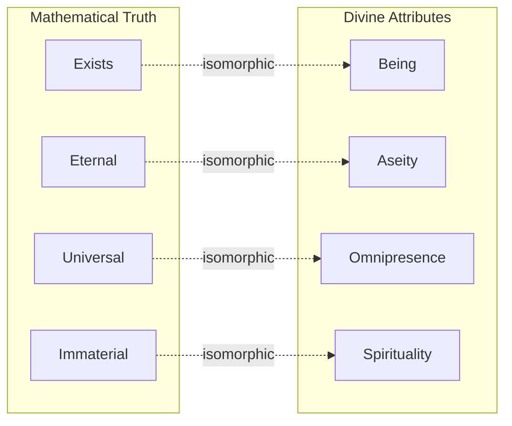
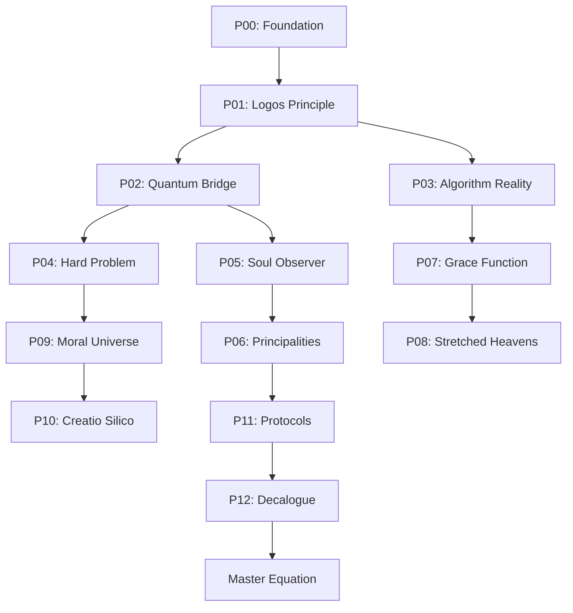
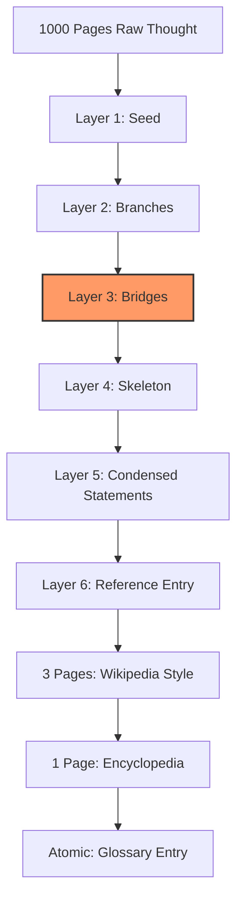
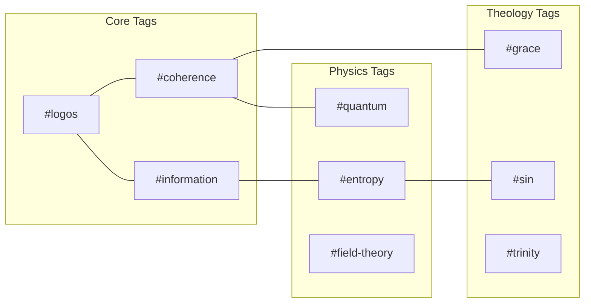

# Connection Maps

> Mermaid diagrams showing logical flow and relationships.

---

## Axiom Chain (Causal Flow)

---

## Concept Bridges

---

## Paper Cross-References

---

## Six-Layer Compression Flow

---

## Tag Network

---

*Run `python Scripts/build_mermaid.py` to regenerate from current data*
