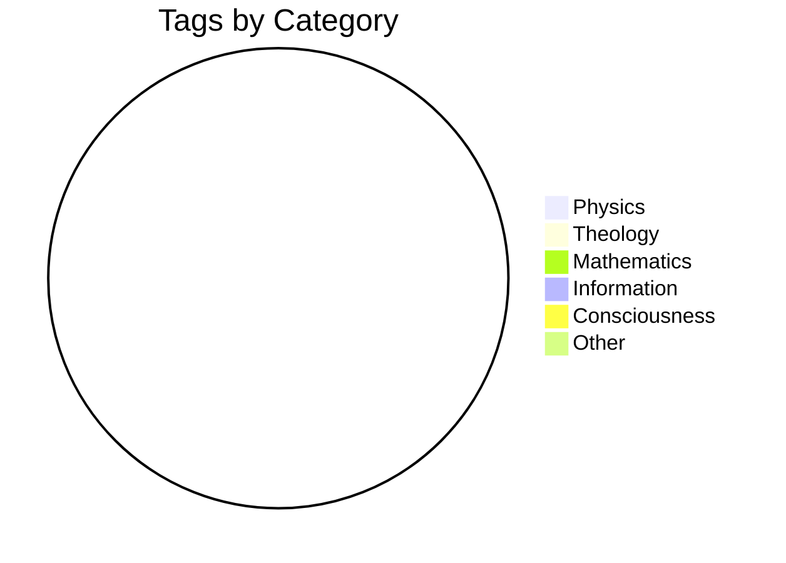

# Statistics Dashboard

> Auto-generated statistics for this paper/section.

---

## Content Metrics

| Category | Count | Details |
|----------|-------|---------|
| **Equations** | 0 | `$...$` and `$$...$$` blocks |
| **Definitions** | 0 | Terms with formal definitions |
| **Axioms** | 0 | Numbered axioms (A1, A2...) |
| **Claims** | 0 | Statements requiring evidence |
| **Tags** | 0 | Unique tags used |
| **Links** | 0 | Internal + external links |
| **References** | 0 | Academic citations |

---

## Tag Distribution

---

## Equation Complexity

| Complexity | Count | Examples |
|------------|-------|----------|
| Simple (1-3 symbols) | 0 | `E = mc²` |
| Medium (4-10 symbols) | 0 | `dχ/dt = -λS + κFC` |
| Complex (10+ symbols) | 0 | Full Lagrangians |

---

## Link Health

| Status | Count |
|--------|-------|
| Valid Internal | 0 |
| Valid External | 0 |
| Broken | 0 |
| Unchecked | 0 |

---

## Word Statistics

| Metric | Value |
|--------|-------|
| Total Words | 0 |
| Unique Words | 0 |
| Avg Words/Section | 0 |
| Reading Time | 0 min |

---

## Six-Layer Compression Status

| Layer | Extracted | Verified |
|-------|-----------|----------|
| Seed | [ ] | [ ] |
| Branches | [ ] | [ ] |
| Bridges | [ ] | [ ] |
| Skeleton | [ ] | [ ] |
| Condensed | [ ] | [ ] |
| Reference | [ ] | [ ] |

---

*Last updated: Run `python Scripts/count_stats.py` to refresh*
