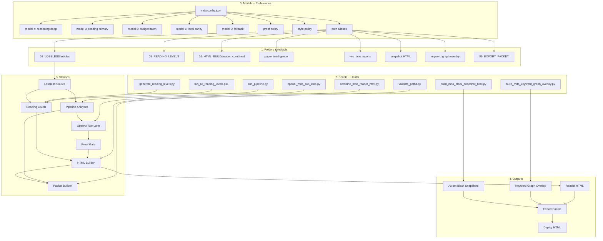

# MDA Portable Repo Mermaid Map

This diagram is the proposed portable architecture. Bottom row is model/config/preferences. The upper rows depend on it.

```mermaid
flowchart TB
  subgraph L4["4. Outputs"]
    A["Deploy HTML"]
    B["Reader HTML"]
    C["Axiom Black Snapshots"]
    D["Keyword Graph Overlay"]
    E["Export Packet"]
  end

  subgraph L3["3. Stations"]
    S1["Lossless Source"]
    S2["Reading Levels"]
    S3["Pipeline Analytics"]
    S4["OpenAI Two-Lane"]
    S5["Proof Gate"]
    S6["HTML Builder"]
    S7["Packet Builder"]
  end

  subgraph L2["2. Scripts + Health"]
    R1["generate_reading_levels.py"]
    R2["run_all_reading_levels.ps1"]
    R3["combine_mda_reader_html.py"]
    R4["build_mda_black_snapshot_html.py"]
    R5["build_mda_keyword_graph_overlay.py"]
    R6["openai_mda_two_lane.py"]
    R7["run_pipeline.py"]
    R8["validate_paths.py"]
  end

  subgraph L1["1. Folders + Artifacts"]
    F1["01_LOSSLESS/articles"]
    F2["05_READING_LEVELS"]
    F3["06_HTML_BUILD/reader_combined"]
    F4["paper_intelligence"]
    F5["two_lane reports"]
    F6["snapshot HTML"]
    F7["keyword graph overlay"]
    F8["09_EXPORT_PACKET"]
  end

  subgraph L0["0. Models + Preferences"]
    M0["mda.config.json"]
    M1["model 4: reasoning deep"]
    M2["model 3: reading primary"]
    M3["model 2: budget batch"]
    M4["model 1: local sanity"]
    M5["model 0: fallback"]
    P1["proof policy"]
    P2["style policy"]
    P3["path aliases"]
  end

  M0 --> M1
  M0 --> M2
  M0 --> M3
  M0 --> M4
  M0 --> M5
  M0 --> P1
  M0 --> P2
  M0 --> P3

  P3 --> F1
  P3 --> F2
  P3 --> F3
  P3 --> F4
  P3 --> F5
  P3 --> F6
  P3 --> F7
  P3 --> F8

  F1 --> S1
  S1 --> S2
  S1 --> S3
  S3 --> S4
  S4 --> S5
  S2 --> S6
  S5 --> S6
  S6 --> S7
  S3 --> S7

  R1 --> S2
  R2 --> S2
  R3 --> S6
  R4 --> C
  R5 --> D
  R6 --> S4
  R7 --> S3
  R8 --> S7

  S6 --> B
  C --> E
  D --> E
  B --> E
  E --> A
```
