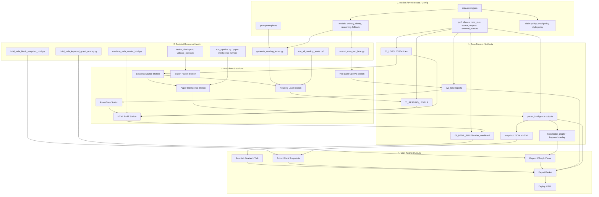

# Prompt For Portable Repo Rewrite

You are helping package the MDA publication workflow into a portable repo.

Goal: rewrite the scripts so the workflow can move to GitHub, a new drive, or a new machine without breaking path assumptions.

Do not start by changing article content. Start by mapping the system.

## Required Output

Produce:

1. A repo map.
2. A config contract.
3. A path-agnostic rewrite plan.
4. A migration checklist.
5. A test checklist.

## Core Rule

No script should hardcode:

- `X:\WORKFLOWS\MDA-PUBLICATION`
- `C:\Users\lowes\Documents\Codex\...`
- `\\dlowenas\...`

Those must become config values.

## Proposed Layers

Use this architecture:



## Proposed Config Contract

Create `mda.config.example.json`:

```json
{
  "paths": {
    "repo_root": ".",
    "lossless_articles": "01_LOSSLESS/articles",
    "reading_levels": "05_READING_LEVELS",
    "html_build": "06_HTML_BUILD/reader_combined",
    "export_packet": "09_EXPORT_PACKET",
    "pipeline_analytics": "outputs/paper_intelligence",
    "two_lane_reports": "outputs/two_lane_openai",
    "snapshot_html": "outputs/axiom_black_snapshots",
    "keyword_overlay": "outputs/keyword_graph_overlay"
  },
  "models": {
    "reading_primary": "gpt-4o",
    "reading_budget": "gpt-4o-mini",
    "math_review": "gpt-4o-mini",
    "reasoning_deep": "o3",
    "fallback": "gpt-4o-mini"
  },
  "policies": {
    "proof_gate_required": true,
    "no_proof_overclaim": true,
    "easy_academic_fallback_allowed": true,
    "source_spine_read_only": true
  }
}
```

## Rewrite Targets

Rewrite these first:

- `READING_LEVEL_GENERATOR/generate_reading_levels.py`
- `READING_LEVEL_GENERATOR/run_all_reading_levels.ps1`
- `05_HTML_BUILD/combine_mda_reader_html.py`
- `work/build_mda_black_snapshot_html.py`
- `work/build_mda_keyword_graph_overlay.py`
- `X:\apps\paper-intelligence-suite-python\12_HEARTBEAT\openai_mda_two_lane.py`

## Acceptance Tests

A rewrite is not accepted unless:

- It runs from a copied repo at a different path.
- It can run with `mda.config.json`.
- It can run with no `X:\` paths.
- It can build one article.
- It can build all 61 article shells.
- It reports missing Easy/Academic files instead of silently pretending they exist.
- It reports proof tabs as structural unless claims are actually promoted.

## Final Report Format

```markdown
PORTABLE_REPO_REWRITE_STATUS

Repo root tested:
Config file:
Scripts rewritten:
Hardcoded paths removed:
One-article build:
Full build:
Remaining blockers:
Proof overclaim safeguards:
Next command:
```
