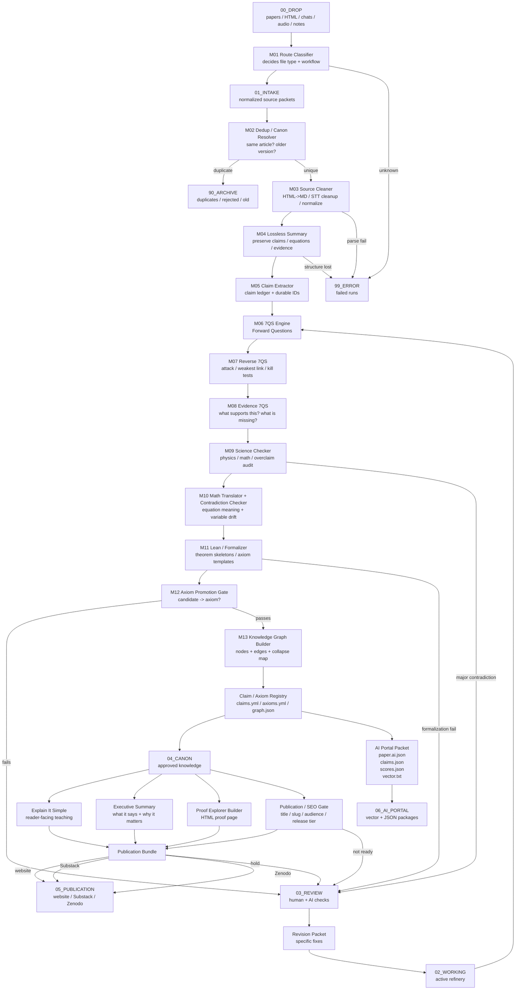
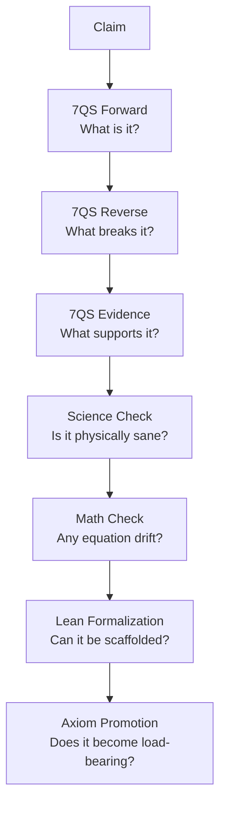

# Knowledge-Refinery Conductor (One Map, Strict Gates)

This is the routing clarity layer: **drop -> stations -> artifacts -> publish targets**.

Design:
- One conductor
- 13 model roles (M01..M13)
- Many stations (packet folders)
- Strict gates (REVIEW vs ERROR vs ARCHIVE vs CANON)
- 7QS is a controlled sequence, not one blob

## Canonical folder layout (front door)

```
X:\knowledge-refinery\
  00_DROP\
  01_INTAKE\
  02_WORKING\
  03_REVIEW\
  04_CANON\
  05_PUBLICATION\
  06_AI_PORTAL\
  10_STATIONS\
  20_REGISTRIES\
  30_PROMPTS\
  40_CONFIG\
  50_LOGS\
  90_ARCHIVE\
  99_ERROR\
```

## Station packets

Every station exists as:
- `X:\knowledge-refinery\10_STATIONS\<nn_station_id>\{INPUT,OUTPUT,REVIEW,ARCHIVE,ERROR,CONFIG,PREFS,PROMPTS,SCRIPTS,LOGS}`

The conductor’s enforcement rule:
- Outputs must use canonical filenames so downstream wiring is declarative.

## End-to-end flow (DAG)



## 13 model roles (contract)

```mermaid
flowchart LR

M01["M01 Router<br/>small fast model"]
M02["M02 Dedup<br/>embedding + reranker"]
M03["M03 Cleaner<br/>code/text model"]
M04["M04 Lossless Summarizer<br/>long-context model"]
M05["M05 Claim Extractor<br/>structured JSON model"]
M06["M06 7QS Forward<br/>reasoning model"]
M07["M07 7QS Reverse<br/>adversarial model"]
M08["M08 Evidence Finder<br/>citation/literature model"]
M09["M09 Science Checker<br/>physics/math model"]
M10["M10 Math Contradiction<br/>math/code model"]
M11["M11 Lean Formalizer<br/>Lean/proof model"]
M12["M12 Axiom Promoter<br/>highest reasoning model"]
M13["M13 Knowledge Graph<br/>graph extraction model"]

M01 --> M02 --> M03 --> M04 --> M05 --> M06 --> M07 --> M08 --> M09 --> M10 --> M11 --> M12 --> M13
```



## 7QS is a sequence (core loop)



## Next wiring step (minimal, high leverage)

1) Require every station to emit canonical filenames in its `OUTPUT/`.
2) Add a validator that fails runs when required artifacts are missing (routes to `99_ERROR` with reasons).
3) Point all station model paths to the canonical model base (`X:\knowledge-refinery\_MODELS\...`).

