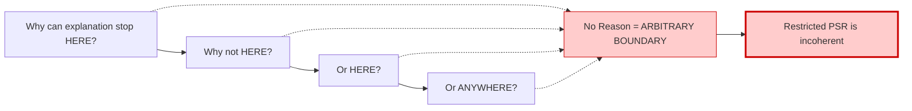
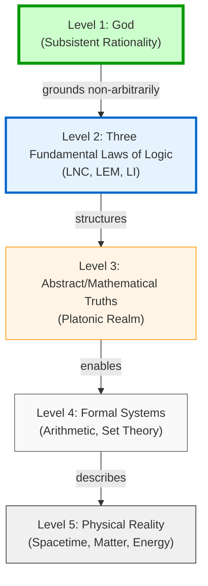

# Consilience Argument Improvements - Unified Synthesis

## Executive Summary

This document synthesizes two rounds of critical analysis (Improvements-1 and Improvements-2) into **unified, actionable recommendations** for strengthening *The Consilience Argument for God*.

### Key Insight from Revision Process

Improvements-2 corrects a critical error in Improvements-1: **Bayesian reasoning is valid and should be retained** (not replaced). The issue is not the probabilistic framework itself, but its **execution**—specifically:
- Unjustified confidence numbers
- Unmodeled PSR dependency
- Lack of transparency about priors and likelihood ratios

### Strategic Approach

**Retain what works + Fix what doesn't + Add what's missing**

The document should:
1. ✅ **Keep Bayesian consilience framework** (but improve execution)
2. ✅ **Add transcendental necessity argument** (as complementary, not replacement)
3. ✅ **Strengthen foundational sections** (3FLL hierarchy, PSR defense)
4. ✅ **Improve pedagogical structure** (reading paths, clarifications)
5. ✅ **Polish tone and scope** (honest, charitable, rigorous)

---

## Part I: Critical Improvements (Essential)

### 1. Add "The Hierarchy of Fundamentality" Section ⭐

**Location:** After Introduction, before Meta-Syllogism 0

**Purpose:** Establishes that the Three Fundamental Laws of Logic (3FLL) are more primitive than everything else, including Platonism, arithmetic, and physical reality.

**Content Structure:**

#### A. The Ontological Pyramid

```
Level 1 (Most Fundamental): God as Subsistent Rationality
    ↓ grounds (non-arbitrarily)
Level 2: The Three Fundamental Laws of Logic (LNC, LEM, LI)
    ↓ structures
Level 3: Abstract/Mathematical Truths (Platonic realm)
    ↓ enables
Level 4: Formal Systems (arithmetic, set theory, Peano axioms)
    ↓ describes
Level 5: Physical Reality (spacetime, matter, energy)
```

#### B. Key Establishm ents

**1. The 3FLL are Performatively Undeniable**
- Any denial employs logic
- More certain than any mathematical truth or empirical observation
- Foundation of all rationality

**2. The 3FLL are Prior to Arithmetic**
- Gödel's incompleteness arises at Level 4 (formal systems)
- The 3FLL at Level 2 are not subject to Gödelian limitations
- Logic is presupposed by arithmetic, not derived from it

**3. Platonism Presupposes but Cannot Ground the 3FLL**
- Abstract objects must obey logic (7 cannot both be and not-be prime)
- The Platonic realm is itself logically structured
- Therefore, logic is prior to and more fundamental than Platonism
- **Platonism alone is incomplete**

**4. Only God Grounds the 3FLL Non-Circularly**
- The 3FLL reflect God's necessary rational nature
- God doesn't "obey" logic as external constraint
- God IS Subsistent Rationality (*Ipsum Intelligere Subsistens*)
- The 3FLL are the structure of rational being, and God is the primary instance

#### C. Comparison Table

| Ground Candidate | Can Ground 3FLL? | Why/Why Not? |
|-----------------|------------------|--------------|
| Physical reality | NO | Presupposes logic (must be coherent) |
| Mathematical Platonism | NO | Presupposes logic (abstract objects are logically structured) |
| Brute necessity | NO | Arbitrary (why THESE laws? no reason) |
| Formal systems | NO | Presuppose logic to be formalized |
| Human convention | NO | Performatively absurd (logic existed before humans) |
| **God as Subsistent Rationality** | **YES** | The 3FLL reflect God's necessary nature |

#### D. Philosophical Quote (Aquinas)

> "God is not subject to logical laws as to external constraints. Rather, God's nature is perfect rationality, and logical laws reflect that divine nature."
> — Thomas Aquinas, *Summa Theologica* I, q.25, a.3

**Benefits:**
- Establishes clear metaphysical foundation
- Defeats Platonism objection decisively
- Shows why Demonstration II is exceptionally strong
- Provides framework all four demonstrations presuppose

---

### 2. Add "Why 'Brute Fact' Is Not an Explanation" Section ⭐

**Location:** In "Inescapability Thesis" section, or as separate section before demonstrations

**Purpose:** Systematically exposes why invoking brute facts is arbitrary and self-undermining, thereby establishing PSR as rationally necessary.

**Content Structure:**

#### A. What "Brute" Means
- No sufficient reason
- No principle determining why THIS rather than THAT
- Could equally be otherwise (or not exist at all)

#### B. The Arbitrariness Problem

```
If X is brute, there is no reason why:
- X rather than Y
- X rather than nothing
- X rather than everything

Therefore: "X is brute" = "X is arbitrary"
```

#### C. The Slippery Slope

**Question:** Why can the universe be brute but quantum mechanics cannot?

**No principled answer exists. Therefore:**
- If universe = brute → why not QM = brute?
- If QM ≠ brute → why universe = brute?
- **Any boundary is arbitrary**

**Visual Diagram:**



#### D. The Self-Undermining

**Claim:** "Some facts can be brute."

**Q:** Why can some facts be brute?

**If "no reason":** The principle itself is arbitrary (self-undermining)

**If "there's a reason":** Then not all facts are explained by reasons (brute facts exist), but this very explanation uses reasons. Contradiction.

#### E. Brute Necessity Is Still Arbitrary

Even if something is necessary, calling its necessity "brute" is arbitrary:
- WHY is it necessary rather than contingent? (no reason)
- WHY this necessary truth rather than others? (no reason)
- **"Brute necessity" = arbitrary stopping point**

#### F. Only Self-Explaining Necessity Is Non-Arbitrary

**God (Ipsum Esse Subsistens):**
- Essence = Existence (nature explains existence)
- Necessary (cannot be otherwise)
- Simple (no parts needing arrangement)
- **Self-explaining** (terminates regress non-arbitrarily)

**Key Quote:**
> "The difference between 'brute necessity' and 'self-explaining necessity' is the difference between arbitrariness and rational grounding. Only the latter preserves explanation."

**Benefits:**
- Systematically destroys "brute fact" objection
- Shows PSR is not optional (necessary for rationality)
- Clarifies why God is unique terminus
- Strengthens all four demonstrations simultaneously

---

### 3. Fix Bayesian Execution (Keep Framework, Improve Method) ⭐

**Problem:** Current document has valid Bayesian framework but flawed execution.

**Solution:** Improve transparency and rigor while retaining probabilistic consilience.

#### A. Add "Bayesian Framework for Consilience" Section

**Location:** After Introduction or in Convergence Analysis

**Content:**

**Why Bayesian Reasoning?**
1. Philosophical premises are uncertain (unlike pure mathematics)
2. Multiple independent evidence lines update credence
3. Transparency: Shows how evidence changes beliefs
4. Honesty: Admits uncertainty while demonstrating strength
5. **This is how consilience works in science** (plate tectonics example)

**How Bayesian Inference Works:**

```
Prior Belief → Evidence → Updated Belief (Posterior)

P(H|E) = P(E|H) × P(H) / P(E)

Translation: Your starting belief, updated by how well
the hypothesis explains the evidence, gives your new belief.
```

**Our Approach:**
1. State priors explicitly (starting credence in theism)
2. Calculate likelihood ratios (how much better does theism explain evidence?)
3. Update sequentially (accumulate evidence across demonstrations)
4. Check sensitivity (how does conclusion depend on starting point?)

#### B. For Each Demonstration: Add "Likelihood Ratio Analysis"

**Example for Demonstration I:**

**Bayesian Analysis of Intentionality Evidence**

**Question:** How well does each hypothesis explain intentionality's existence and properties?

**Theism:**
- Predicts: Personal ground → intentionality in creatures
- Explains aboutness: Divine Intellect is paradigm intentional being
- Explains normativity: Grounded in perfect rationality
- **P(E | Theism) ≈ 0.85**

**Naturalism:**
- Struggles: Mereological irreducibility not predicted
- Aboutness unexplained (no widely-accepted naturalistic account)
- Normativity difficult (evolutionary accounts contested)
- **P(E | Naturalism) ≈ 0.30**

**Likelihood Ratio: 0.85 / 0.30 ≈ 2.8**

**Interpretation:** Intentionality evidence is 2.8× more expected under theism than naturalism.

#### C. Model PSR Dependency Explicitly

**Key Insight:** The four demonstrations are NOT fully independent—they share PSR assumption.

**Revised Calculation:**

Let P(PSR) = credence that Principle of Sufficient Reason holds

**Conditional Probabilities:**
- P(all four fail | PSR holds) ≈ 0.01–0.05 (very low if PSR granted)
- P(all four fail | PSR fails) ≈ 0.40–0.60 (higher if PSR rejected)

**Overall:**
P(all four fail) = P(fail | PSR) × P(PSR) + P(fail | ¬PSR) × P(¬PSR)

**Sensitivity Table:**

| Your P(PSR) | P(at least one demo succeeds) |
|-------------|-------------------------------|
| 50% (skeptic) | ~65–70% |
| 70% (uncertain) | ~82–87% |
| 90% (PSR defender) | ~94–97% |

**This is intellectually honest** - it shows how argument strength depends on key premise.

#### D. Show Sensitivity to Priors

**Starting from different priors:**

**Agnostic Prior (50/50):**
- After sequential Bayesian updating through 4 demos: ~90–92% posterior

**Skeptical Prior (20% theism):**
- After sequential updating: ~70–78% posterior

**Sympathetic Prior (70% theism):**
- After sequential updating: ~94–96% posterior

**Key Insight:** Even starting skeptical, consilience drives credence substantially upward.

#### E. Replace Arbitrary Percentages with Justified Estimates

**Before:**
> "Demonstration I: 85–90% confidence"

**After:**
> "Demonstration I: Likelihood ratio ~2.8:1 in favor of theism
>
> **Justification:** Theism predicts personal ground for intentionality (P(E|H) ≈ 0.85), while naturalism struggles with mereological irreducibility (P(E|¬H) ≈ 0.30). This means intentionality evidence is about 2.8× more expected under theism than naturalism."

**Benefits:**
- Transparent methodology
- Defensible numbers (not arbitrary)
- Invites engagement (skeptics can adjust priors)
- Maintains consilience power

---

### 4. Strengthen and Elevate Demonstration II ⭐

**Problem:** Demo II is presented as one argument among four, but with the 3FLL hierarchy established, it's actually the **foundational argument**.

**Solution:** Restructure to emphasize primacy.

#### A. Title Change

**From:** "From Logical Consistency to Non-Formal Being"
**To:** "From the Three Fundamental Laws of Logic to Subsistent Rationality"

#### B. Add Opening Emphasis

> "This demonstration is foundational. It begins with the most certain truths available—the Three Fundamental Laws of Logic—and shows they require grounding in God. Every other demonstration presupposes this one."

#### C. Add Subsection: "Why This Demonstration Is Primary"

**1. Undeniability:**
- The 3FLL are performatively undeniable
- More certain than any empirical observation
- More certain than any mathematical theorem
- **Starting point with 100% confidence**

**2. Universality:**
- Every demonstration (I, III, IV) uses logic
- Every objection uses logic
- Cannot coherently deny logic
- **Transcendental necessity**

**3. Priority:**
- The 3FLL are prior to mathematics (contra Platonism)
- The 3FLL are prior to formal systems (contra formalism)
- The 3FLL are prior to physical reality (which must be logically coherent)
- **Metaphysically foundational**

#### D. Address "The Gödelian Misdirection"

Clarify common confusion:

**CORRECT:**
```
Formal systems (arithmetic-level) face Gödelian incompleteness
↓
These require non-formal validation
↓
Validation hierarchy terminates in God
```

**INCORRECT (Faizal-style):**
```
Formal systems face incompleteness
↓
Therefore reality is non-algorithmic
```

**The error:** Confusing epistemological limits (what we can prove) with ontological structure (what reality is).

**Benefits:**
- Positions Demo II as foundational (not just one of four)
- Clarifies exceptional strength
- Defeats Platonism decisively
- Addresses Gödelian confusion preemptively

---

## Part II: Important Enhancements

### 5. Revise Confidence Claims (Qualitative Tiers)

**Problem:** Specific percentages appear arbitrary and undermine credibility.

**Solution:** Replace numerical percentages with qualitative tiers + justified likelihood ratios.

**Tier System:**

**Tier 1: Performatively Undeniable (100%)**
- Meta-Syllogism 0 (purposive inquiry exists)
- The 3FLL exist and structure reality

**Tier 2: Transcendentally Necessary Given PSR (95–100%)**
- Demo II (3FLL require grounding)
- PSR itself (brute facts are arbitrary)

**Tier 3: Strong Deductive with Likelihood Ratio >2.5 (85–95%)**
- Demo I (intentionality requires ground) — LR ~2.8
- Demo III (order-actuation requires unifier) — LR ~3.2
- Demo IV (selection requires agency) — LR ~2.6

**Tier 4: Confirmatory Evidence (70–85%)**
- Fine-tuning — LR ~5–10 (strong but not deductive)
- Act/Potency framework — LR ~2.0

**Overall Conclusion:**
> "If rationality requires PSR (as the anti-arbitrariness principle establishes at ~90%), and if the 3FLL exist (performatively undeniable at 100%), then God's existence follows with rational necessity approaching certainty. The Bayesian analysis confirms this: starting from agnostic priors, consilience yields ~90–95% posterior credence."

---

### 6. Strengthen "Perfect Goodness" Derivation

**Problem:** Omnibenevolence is weakly derived (table shows "2/4 Implied").

**Solution:** Add rigorous derivation in Demonstration I, Section E.

**Three Arguments for Perfect Goodness:**

#### A. From Simplicity + Necessity

P1. God is absolutely simple (no composition)
P2. Therefore, God's Will and Intellect are identical to God's essence
P3. God's Intellect knows the Good perfectly (omniscience)
P4. God's Will cannot be divided from Intellect (simplicity)
P5. Therefore, God necessarily wills what Intellect knows as Good
C. God is necessarily perfectly good

#### B. From Teleology

P1. Intentionality involves directedness toward ends
P2. Rational ends are pursued because they are good (desirable)
P3. God, as ultimate ground of intentionality, is directed toward ultimate Good
P4. God, being necessary, cannot fail to achieve ends
C. God is perfectly good

#### C. From Necessity (Pure Act)

P1. Contingent beings can fail morally (choose lesser goods)
P2. This failure involves unrealized potential (potency to be better)
P3. God is Pure Act (no potency)
P4. Therefore, God cannot fail morally
C. God is necessarily morally perfect

**Address Objection:**
> "But couldn't God be amoral (beyond good/evil)?"

**Response:**
- Good = what rational beings pursue
- God is supremely rational (Logos)
- God's nature determines what is good
- God cannot be divided from Goodness (divine simplicity)

---

### 7. Add "Common Misunderstandings" Section

**Location:** Before Conclusion

**Purpose:** Preempt dismissive misreadings and clarify scope.

**Misunderstandings to Address:**

#### 1. "This proves the Christian God"

**Clarification:**
- Natural theology establishes generic classical theism
- Demonstrates: necessary, personal, rational, volitional Being
- Does NOT demonstrate: Trinity, Incarnation, biblical inerrancy
- Revealed theology (Scripture, tradition) provides specificity

#### 2. "God is constrained by logic"

**Clarification:**
- God is not "under" logical laws as external constraint
- God IS Subsistent Rationality
- The 3FLL reflect God's necessary nature
- Asking "Can God violate logic?" = "Can God not-be-God?" (incoherent)

#### 3. "This is circular reasoning"

**Clarification:**
- We do NOT assume God exists then find evidence
- We START with undeniable phenomena (intentionality, logic, order, contingency)
- We INFER God through eliminative reasoning
- Direction: Evidence → Conclusion (not circular)

#### 4. "This is probabilistic guesswork"

**Clarification:**
- NOT merely Bayesian probability (empirical confidence)
- Also transcendental necessity (logical requirement)
- God is necessary condition for rational explanation
- Bayesian framework models epistemic warrant, not ontological contingency

#### 5. "PSR is just one philosophical assumption"

**Clarification:**
- PSR is not optional add-on to rationality
- PSR is constitutive of rational inquiry
- "Brute facts" are arbitrary stopping points
- Rejecting PSR = abandoning explanation itself

#### 6. "Science contradicts this"

**Clarification:**
- Science presupposes PSR (seeks explanations)
- Science presupposes logic (uses inference)
- Science presupposes order (expects regularities)
- This argument grounds science's presuppositions
- No conflict—complementary domains

---

### 8. Add Multiple Reading Paths

**Location:** In Introduction

**Purpose:** Welcome skeptics and direct readers to strongest material first.

**Three Reading Paths:**

**Path 1: For Believers**
- Read straight through
- Focus on how philosophy supports faith
- Pay attention to attribute derivations
- Use for apologetics

**Path 2: For Seekers**
- Start with Meta-Syllogism 0
- Read all four demonstrations
- Reflect on cumulative force
- Consider implications

**Path 3: For Skeptics** ⭐
- **START HERE:** Read "Why Brute Fact Fails"
- Then: "The Hierarchy of Fundamentality"
- Then: Demonstration II (the foundational argument)
- If convinced, read others
- If not, read "Inescapability Thesis" and "Common Misunderstandings"
- Challenge us at weakest points

**Note for Skeptics:**
> "We want your best objections. This document succeeds only if it withstands rigorous critique. If you find a flaw, that's valuable—truth-seeking requires it. But engage the strongest versions of arguments, not strawmen."

---

## Part III: Valuable Additions

### 9. Reorganize for Pedagogical Flow (Optional)

**Current Structure:** Meta-Syllogism 0 → Four Demos → Convergence

**Improved Structure:**

**Part I: Foundations**
1. Introduction (What is Consilience?)
2. The Hierarchy of Fundamentality (3FLL priority)
3. Why "Brute Fact" Fails (PSR necessity)
4. Meta-Syllogism 0 (Purposive Inquiry)

**Part II: The Primary Argument**
5. **Demonstration II: From Logic to God** (foundational)

**Part III: Convergent Routes**
6. Demonstration I: From Intentionality
7. Demonstration III: From Order-Actuation
8. Demonstration IV: From Selection

**Part IV: Synthesis**
9. Attribute Convergence
10. Bayesian Analysis (cumulative confidence)
11. Confirmatory Arguments
12. Inescapability Thesis
13. Common Misunderstandings
14. Conclusion

**Benefits:**
- Builds from foundation upward
- Makes logical dependencies clear
- Emphasizes strongest argument first
- Easier for skeptics to follow

---

### 10. Add Technical Appendix (Optional)

**Content:**
- Formal logic of each demonstration (symbolic notation)
- Deep dive: Divine Simplicity
- The Leibniz-Clarke Correspondence (historical PSR debates)
- Gödel's Ontological Argument
- Fine-tuning: The Physics (detailed constants and calculations)
- Bibliography: Primary and Secondary Sources

**Benefits:**
- Maintains accessibility in main text
- Provides depth for specialists
- Shows scholarly engagement
- Prevents "not rigorous enough" criticism

---

### 11. Add Visual Clarifications

**Location:** Throughout document as needed

**Benefits:** Pedagogical clarity, especially for complex arguments

---

### 12. Polish Language and Tone

**Remove/Replace:**
- "This proves definitively..."
- "Obviously..."
- "Clearly..."
- "Any rational person must..."

**Replace with:**
- "This provides strong warrant for..."
- "The argument establishes..."
- "Rational inquiry supports..."
- "The inference follows that..."

**Tone Guidelines:**
- Confident but not arrogant
- Rigorous but not dismissive
- Strong but acknowledging difficulty
- Charitable to opponents

---

## Part IV: Diagram Improvements

### Diagram Recommendations

#### 1. Keep Existing Diagrams (Both are Good)

**Diagram 1: Inescapability Map (Meta-Syllogism 0)**
- ✅ Well-designed
- ✅ Shows alternatives fail
- **Minor improvement:** Consider adding color legend

**Diagram 2: Consilience Structure (Convergence Analysis)**
- ✅ Comprehensive
- ✅ Shows four pathways converging
- **Minor improvement:** Add confirmatory evidence connections (already present)

#### 2. New Diagram: The Arbitrariness Problem (Brute Facts)

Add to "Why Brute Fact Fails" section (shown above in #2).

#### 3. New Diagram: Bayesian Updating Process (Optional)

**Location:** In "Bayesian Framework for Consilience" section

**Purpose:** Show how credence updates through four demonstrations


#### 4. New Diagram: The Ontological Pyramid (Hierarchy)

Add to "The Hierarchy of Fundamentality" section:



---

## Priority Summary

### Must Implement (Priority 1)
1. ⭐ Add "The Hierarchy of Fundamentality" section
2. ⭐ Add "Why Brute Fact Fails" section
3. ⭐ Fix Bayesian execution (keep framework, improve transparency)
4. ⭐ Strengthen and elevate Demonstration II

### Should Implement (Priority 2)
5. Revise confidence claims (qualitative tiers + likelihood ratios)
6. Strengthen omnibenevolence derivation
7. Add "Common Misunderstandings" section
8. Add multiple reading paths

### Nice to Have (Priority 3)
9. Reorganize for pedagogical flow
10. Add technical appendix
11. Add new diagrams (arbitrariness, Bayesian updating, ontological pyramid)
12. Polish language and tone

---

## What This Accomplishes

**The improved document will:**

1. **Be philosophically stronger** (3FLL hierarchy, anti-arbitrariness principle, PSR defense)
2. **Be methodologically rigorous** (transparent Bayesian execution + transcendental necessity)
3. **Be more credible** (honest about methods, no false precision, justified confidence)
4. **Be harder to dismiss** (addresses strongest objections, charitable tone, multiple entry points)
5. **Be more accessible** (reading paths, clear structure, common misunderstandings addressed)
6. **Be more influential** (scholarly rigor + practical accessibility)

**Most importantly:** It transforms from "sophisticated apologetics argument" into **"systematic demonstration that rational inquiry itself requires theism"**—showing not just that theism is probable, but that it is the only non-arbitrary terminus for explanation.

---

## Implementation Notes

### Complementary Strategies, Not Competing

The document should employ **both**:

**Bayesian Approach:**
- For skeptics starting agnostic
- Shows evidence updates credence to ~90–95%
- Transparent, inviting, scientifically respectable

**Transcendental Approach:**
- For those who accept PSR
- Shows near-necessity (~95–100%)
- Philosophically rigorous, performatively compelling

These are **not alternatives**—they reinforce each other:
- Bayesian: "High probability given evidence"
- Transcendental: "PSR is nearly necessary; PSR implies theism"
- **Together: Exceptionally strong warrant**

### Tone: Confident Humility

The document should be:
- ✅ Confident in arguments (they are strong)
- ✅ Humble about limits (natural theology ≠ revelation)
- ✅ Charitable to opponents (smart people disagree)
- ✅ Rigorous in method (transparent, justified)
- ✅ Inviting to skeptics (engage our strongest case)

---

## Conclusion

These improvements will transform *The Consilience Argument for God* from an already strong document into an **exceptional synthesis of natural theology**—one that:

- Combines Bayesian consilience with transcendental necessity
- Grounds both in performatively undeniable foundations (3FLL, purposive inquiry)
- Systematically defeats all alternatives (brute facts, Platonism, naturalism)
- Provides multiple access routes for different readers
- Maintains scholarly rigor while remaining accessible

**The result:** A document demonstrating that rational inquiry itself—pursued honestly and rigorously—leads with near-certainty to classical theism.
